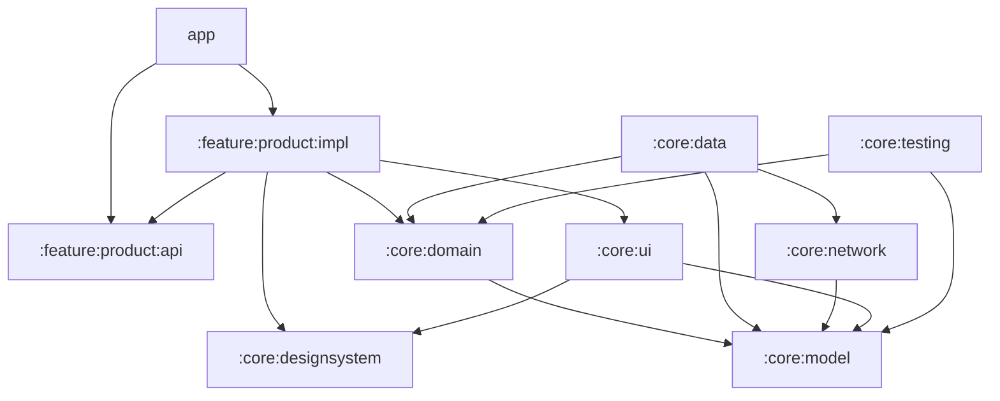
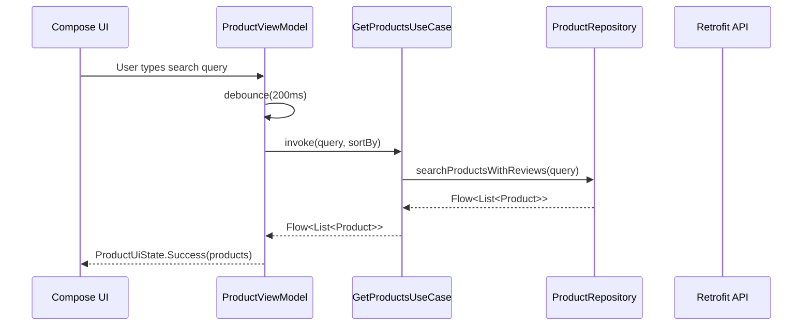
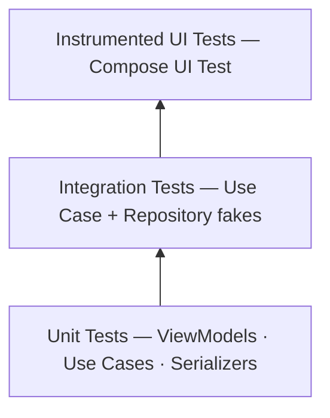

# Modularization Learning Journey

In this learning journey you will learn about the modularization strategy used in the **Sephora** Android app and the reasoning behind the decisions made.

## Overview

The Sephora app is a product discovery application that allows users to browse, search, and sort a product catalogue.

A modularized architecture was chosen because it:

- **Improves build times** — only changed modules are recompiled
- **Enforces boundaries** — features cannot accidentally depend on each other's internals
- **Enables parallel work** — teams can own individual modules independently
- **Improves testability** — each layer can be tested in isolation using fakes

## Module Types

The Sephora app contains the following types of modules:

- The `:app` module — contains the application entry point (`MainActivity`), Hilt setup, and the top-level navigation host. It depends on all feature modules and required core modules.

- **Feature modules** (`:feature:product`) — each feature is split into two submodules:
    - `:feature:product:api` — public navigation contract (route, entry composable). Other modules depend only on this.
    - `:feature:product:impl` — private implementation (screens, ViewModel, UI state). Depends on `:api` and `:core` modules.

- **Core modules** (`:core:*`) — shared infrastructure consumed by feature modules. No core module depends on a feature module.

## Module Graph

The following diagram shows the dependency graph of the app:



## Architecture Layers

Each module belongs to a layer. The layers are:

```
┌─────────────────────────────────────────────────────┐
│                    UI Layer                         │
│            :feature:product:impl                    │
│  Compose screens · ViewModels · UI state models     │
├─────────────────────────────────────────────────────┤
│                  Domain Layer                       │
│                 :core:domain                        │
│                   Use Cases                         │
├─────────────────────────────────────────────────────┤
│                   Data Layer                        │
│                  :core:data                         │
│       Repository implementations · Data sources    │
├─────────────────────────────────────────────────────┤
│                 Network Layer                       │
│                 :core:network                       │
│          Retrofit · API services · DTOs             │
└─────────────────────────────────────────────────────┘
```

### UI Layer

All screens are built with **Jetpack Compose**. Each screen has two composable overloads:

1. **Stateful overload** — wires in the ViewModel via `hiltViewModel()`, used in production navigation
2. **Stateless overload** — takes plain parameters only, used in UI tests without Hilt

```kotlin
// Stateful — production entry point
@Composable
fun ProductsScreen(
    viewModel: ProductViewModel = hiltViewModel(),
) {
    val uiState by viewModel.uiState.collectAsStateWithLifecycle()
    val searchQuery by viewModel.searchQuery.collectAsStateWithLifecycle()
    ProductsScreen(
        uiState = uiState,
        searchQuery = searchQuery,
        onSearchQueryChanged = viewModel::onSearchQueryChanged,
        onSortSelected = viewModel::onSortSelected,
    )
}

// Stateless — used in UI tests (no Hilt required)
@Composable
internal fun ProductsScreen(
    uiState: ProductUiState = ProductUiState.Loading,
    searchQuery: String = "",
    onSearchQueryChanged: (String) -> Unit = {},
    onSortSelected: (ReviewSortField) -> Unit = {},
)
```

State is exposed as **StateFlow** and collected with `collectAsStateWithLifecycle()`.

### Domain Layer

Business logic lives in **Use Cases** — simple Kotlin classes with a single `invoke()` operator. This keeps ViewModels thin and the logic independently testable.

```kotlin
class GetProductsUseCase @Inject constructor(
    private val productRepository: ProductRepository
) {
    operator fun invoke(query: String, sortBy: ReviewSortField): Flow<List<Product>> =
        if (query.isBlank()) productRepository.getProductsWithReviews()
        else productRepository.searchProductsWithReviews(query)
            .map { products -> products.sortedWith(sortBy.comparator) }
}
```

### Data Layer

Repositories implement the interfaces. The repository syncs remote data on startup and exposes it as a local `Flow`, keeping the UI layer unaware of the network source.

### Network Layer

Retrofit with **Kotlinx Serialization** handles all HTTP communication. Network DTOs are mapped to clean domain models before leaving `:core:data`, so no network type ever leaks into the UI or domain layers.

## Data Flow

Data flows **unidirectionally** from the network up through the repository and use case into the ViewModel, and is finally rendered by the UI.



### Search & Sort — Debounced StateFlow

The `ProductViewModel` combines a debounced search query with the selected sort field using `combine` + `flatMapLatest` to avoid firing unnecessary work on every keystroke:

```kotlin
val uiState: StateFlow<ProductUiState> = combine(
    searchQuery.debounce(200L),
    sortField,
) { query, sort -> Pair(query, sort) }
    .flatMapLatest { (query, sort) ->
        getProductsUseCase(query = query, sortBy = sort)
            .map<List<Product>, ProductUiState> { ProductUiState.Success(it) }
            .catch { emit(ProductUiState.Error) }
    }
    .stateIn(
        scope = viewModelScope,
        started = SharingStarted.WhileSubscribed(5_000),
        initialValue = ProductUiState.Loading,
    )
```

The result maps to a sealed `ProductUiState`:

| State | Trigger | UI shown |
|---|---|---|
| `Loading` | Initial / sync in-flight | Loading wheel |
| `Success` | Products loaded (may be empty list) | Product list or "No results" |
| `Error` | Network or parse error | Error message |

## Challenges

### Time Constraints — 5-Day Sprint

The application was architected, built, and tested within **5 days**. This forced scope trade-offs. The following were designed and partially scaffolded but not completed within the sprint:

- **Offline support** — Room is included as a dependency but not wired up
- **Screenshot tests** — the stateless composable pattern makes this straightforward to add
- **Performance benchmarks** — Macrobenchmark module not yet created

The architecture was deliberately chosen so that these are straightforward additions rather than costly retrofits.

### Inconsistent API Response Types

A significant challenge was discovered during integration: some fields arrive with **different JSON types** across API responses. For example, numeric fields occasionally arrive as strings in the mock API.

The solution was custom **Kotlinx Serialization deserializers** applied only at the network model layer:

```kotlin
object FlexibleIntSerializer : KSerializer<Int?> {
    override val descriptor = PrimitiveSerialDescriptor("FlexibleInt", PrimitiveKind.STRING)

    override fun deserialize(decoder: Decoder): Int? {
        val json = (decoder as JsonDecoder).decodeJsonElement()
        return json.jsonPrimitive.content.toIntOrNull()
    }

    override fun serialize(encoder: Encoder, value: Int?) {
        encoder.encodeInt(value ?: 0)
    }
}
```

Domain models (`Product`) are always clean — the inconsistency is fully absorbed in the network → domain mapping step and never leaks to the UI or domain layers.

## Testing Strategy

Tests follow the **testing pyramid** using **fakes** rather than mocks. All fakes live in `:core:testing` and are shared across all test modules.



### Fakes in `:core:testing`

```kotlin
class TestProductRepository : ProductRepository {
    private val productsFlow = MutableSharedFlow<List<Product>>(
        replay = 1, onBufferOverflow = BufferOverflow.DROP_OLDEST
    )

    override fun getProductsWithReviews(): Flow<List<Product>> = productsFlow
    override fun searchProductsWithReviews(query: String): Flow<List<Product>> =
        productsFlow.map { products ->
            products.filter { it.productName.contains(query, ignoreCase = true) }
        }
    override suspend fun sync() { /* no-op — push data via sendProducts() */ }

    @TestOnly fun sendProducts(products: List<Product>) { productsFlow.tryEmit(products) }
}
```

### Key Patterns

**`MainDispatcherRule`** — replaces the Main dispatcher with `UnconfinedTestDispatcher` for deterministic coroutine execution in unit tests.

**Virtual time for debounce** — advances past the 200 ms window without real waiting:
```kotlin
viewModel.onSearchQueryChanged("Serum")
testScheduler.advanceTimeBy(300L)
assertIs<ProductUiState.Success>(viewModel.uiState.value)
```

**Stateless composable overloads** — UI tests call the stateless overload directly, bypassing Hilt entirely and avoiding `@HiltAndroidTest` setup overhead:
```kotlin
composeTestRule.setContent {
    ProductsScreen(uiState = ProductUiState.Loading)
}
```

## Future Improvements

### Offline Support (Room)

The `:core:data` module already has Room as a dependency. The plan is to implement a **local cache** backed by Room:

1. Implement `Product` and `Review` Room entities and DAOs
2. Have `sync()` write network results into Room
3. Replace the current in-memory flow with a Room-backed `Flow` from the DAO
4. Add a FTS (Full-Text Search) Room table to support offline search

This would deliver a true offline-first experience with **no changes required in the UI or domain layers**.

### Screenshot Testing

The stateless composable pattern already makes screenshot testing straightforward. The recommended approach is [Paparazzi](https://github.com/cashapp/paparazzi) or [Roborazzi](https://github.com/takahirom/roborazzi), which render Compose screens on the JVM without a physical device. Each screen state (Loading, Success, Error) would have a committed golden image, and CI would fail on any unexpected visual regression.

### Performance Benchmarking

[Macrobenchmark](https://developer.android.com/topic/performance/benchmarking/macrobenchmark-overview) would measure real-world performance:

- **Startup time** — cold / warm / hot via `TimeToInitialDisplay`
- **Jank frames** — dropped frames during `LazyColumn` fast-scroll on the product list
- **Baseline Profile generation** — pre-compiles critical code paths to reduce startup JIT overhead
